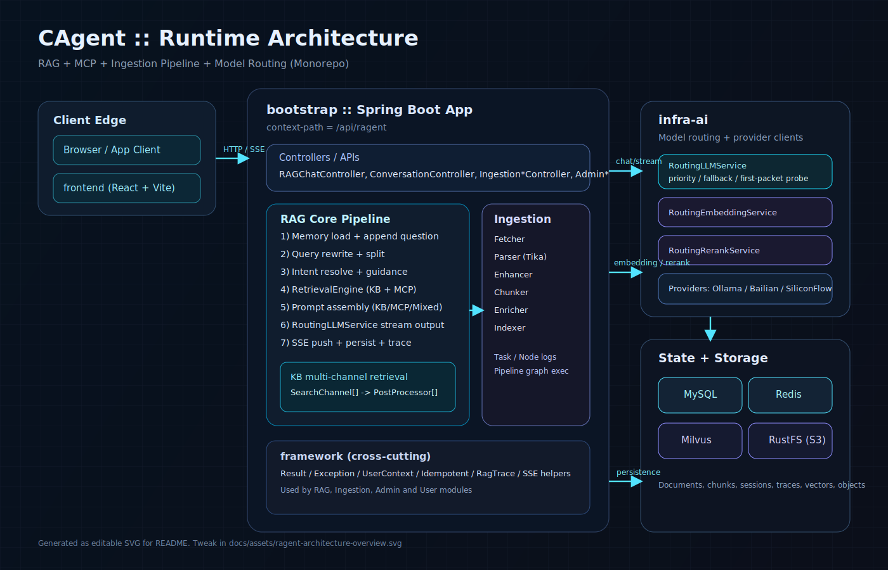

# CAgent — 我的个人 AI 知识中枢


基于 RAG + LLM 构建的个人知识管理与问答系统，服务于我的第二大脑 **GardenOfOpeningClouds**。

后端入口：`http://localhost:8080/api/ragent`

---

## 这是什么

我有一个长期维护的知识体系 GardenOfOpeningClouds，里面积累了大量技术笔记、学习路线和面试复盘。但随着内容增长，我遇到了几个让人头疼的问题：

- **碎片知识检索慢**：笔记散落在各处，想起一个概念却找不到当时的上下文
- **笔记不可对话**：静态 Markdown 文件无法追问，只能反复翻页
- **面试复习分散**：题目、答案、难度分级散落在不同地方，临时抱佛脚效率极低

CAgent 是我为解决这些问题搭建的系统：把知识库向量化，用 RAG 实现对话式检索，同时把学习笔记和面试题库结构化沉淀进来，让知识真正"可被问"。

---

## 我做了什么扩展

在原有 RAG 底座基础上，我新增了两个核心模块：

### 学习中心（Study Center）

用于系统化存储我的技术笔记和学习路线，采用三层结构：

```
模块（Module）
  └── 章节（Chapter）
        └── 文档（Document）
```

- **模块**：对应一个大方向，例如"Java 并发"、"系统设计"、"数据库原理"
- **章节**：模块下的主题划分，例如"AQS 源码"、"锁机制"
- **文档**：具体的知识内容，支持 Markdown 格式

这套结构让我把过去散乱的笔记按学科树组织起来，方便在 RAG 对话时精准定位到具体领域的文档。

### 面试题库（Interview Hub）

用于按分类管理面试题，复习时随时提问：

```
分类（Category）
  └── 题目（Question）
        ├── 难度等级（1-5）
        ├── 参考答案（Markdown）
        └── 标签（逗号分隔）
```

- 按技术方向分类（Java、Redis、MySQL、系统设计…）
- 难度分级，可按需筛选
- 答案支持 Markdown，保留代码块、对比表格等格式

---

## 系统架构

### 总览



### 模块组成

```
frontend (React + Vite)
  └── bootstrap (Spring Boot 应用入口 + 全部业务实现)
        ├── rag            — RAG 对话主链路（v3）
        ├── study          — 学习中心（我新增）
        ├── interview      — 面试题库（我新增）
        ├── knowledge      — 知识库 CRUD + 向量集合管理
        ├── ingestion      — 文档入库 Pipeline
        ├── admin          — 管理后台 Dashboard
        └── user           — 用户认证（SA-Token）

  依赖层：
        ├── framework      — 通用基础（Result/Exception/Trace/Idempotent）
        └── infra-ai       — AI 路由（Chat/Embedding/Rerank 多模型容错）
```

### 运行时拓扑

```
Browser (localhost:5173)
  -> /api/ragent/* (Vite Proxy)
  -> Spring Boot (8080)
       -> rag core (rewrite / intent / retrieve / prompt / memory / mcp)
       -> ingestion engine (pipeline + nodes)
       -> infra-ai (chat / embedding / rerank 多模型路由)
       -> MySQL / Redis / Milvus / RustFS
```

---

## 核心功能

### 对话式知识检索

- RAG v3 流式对话（SSE），支持深度思考模式
- Query Rewrite + 多问句拆分，一个问题自动拆解为多个子查询
- 意图识别 + 意图定向检索：不同意图命中不同知识库分区
- 全局向量兜底：意图置信度不足时自动回退到全局检索
- 后处理器链：去重 → Rerank，提升召回质量
- MCP 工具调用：工具结果与文档上下文统一进入 Prompt
- **Obsidian MCP 集成**：支持读取和更新 Obsidian 笔记（vault: GardenOfOpeningClouds）
- **视频转录入库**：可调用 VideoTranscriptAPI 将 B 站/YouTube/小宇宙链接转录并写入 Obsidian

### 知识沉淀

- 学习中心：模块 → 章节 → 文档三层结构，系统化存储技术笔记
- 知识库：文档上传 → Ingestion Pipeline（解析/分块/向量化）→ Milvus 索引
- 支持 PDF、Word、Markdown 等格式（Apache Tika 解析）
- 多种分块策略：固定大小 / 段落 / 句子 / 结构感知
- **批量上传**：支持批量上传文档，实时追踪上传进度和状态
- **RocketMQ 异步处理**：文档入库通过 RocketMQ 5.x 异步处理，提升大规模导入性能

### 复盘备战

- 面试题库：分类管理题目，难度分级，Markdown 答案
- 会话记忆与摘要：长对话自动摘要，支持跨会话记忆
- RAG Trace 链路追踪：每次对话可查看检索链路详情

---

## 快速启动

### 环境依赖

- JDK 17+
- Maven 3.9+
- Node.js 18+
- MySQL 8+
- Redis
- Docker（用于 Milvus + RustFS）

### 1. 启动向量库与对象存储

```bash
cd resources/docker/milvus
docker compose -f milvus-stack-2.6.6.compose.yaml up -d
```

启动内容：Milvus（19530）、RustFS（9000/9001）、etcd、Attu（8000，Milvus 可视化）

### 2. 配置后端

编辑 `bootstrap/src/main/resources/application.yaml`，检查：

```yaml
spring.datasource.*        # MySQL 连接
spring.data.redis.*        # Redis 连接
milvus.uri                 # 向量库地址
rustfs.*                   # 对象存储地址
ai.providers.*.api-key     # 模型 API Key（百炼 / SiliconFlow）
video-transcript.*         # 视频转录 API 配置（可选）
```

初始化数据库：执行 `resources/database/schema_table.sql`

### 3. 启动后端

```bash
./mvnw -pl bootstrap spring-boot:run
```

### 4. 启动前端

```bash
cd frontend
npm install
npm run dev
```

创建 `frontend/.env.local`：

```
VITE_API_BASE_URL=/api/ragent
```

访问地址：

- 前端：`http://localhost:5173`
- 后端：`http://localhost:8080/api/ragent`

默认管理员账号：`admin / admin`

---

## 测试验证

### 单元测试

项目包含丰富的单元测试，覆盖核心业务逻辑：

- `IntentTreeFactoryTests` — 意图树工厂测试
- `MySQLConversationMemoryStoreTests` — MySQL 会话记忆存储测试
- `RetrievalEngineTests` — 检索引擎测试
- `IngestionPipelineServiceImplTests` — 入库流水线服务测试
- `IngestionTaskServiceImplTests` — 入库任务服务测试

运行测试：
```bash
./mvnw test
```

### 质量测试脚本

项目提供多个端到端测试脚本，位于 `scripts/` 目录：

| 脚本 | 用途 |
|------|------|
| `chat_quality_test.sh` | 对话质量测试 |
| `prompt_regression_matrix.sh` | 提示词与路由回归矩阵（日期/联网/数据库/KB/Obsidian） |
| `trace_fullchain_smoke.sh` | 全链路追踪冒烟测试 |
| `ingestion_pipeline_user_test.sh` | 入库流水线用户测试 |
| `mcp_kb_integration_test.sh` | MCP 与知识库集成测试 |

---

## 配置说明

### 模型配置（`ai.*`）

支持 Ollama / 百炼 / SiliconFlow 三类提供商，每类配置候选列表和优先级：

```yaml
ai:
  selection:
    failure-threshold: 3        # 失败次数阈值，超过则熔断
    open-duration-ms: 60000     # 熔断打开时长
  providers:
    bailian:
      api-key: ${BAILIAN_API_KEY}
    siliconflow:
      api-key: ${SILICONFLOW_API_KEY}
```

### RAG 检索调参（`rag.*`）

```yaml
rag:
  search.channels:
    vector-global.confidence-threshold: 0.7   # 全局向量检索触发阈值
    intent-directed.min-intent-score: 0.6      # 意图定向最低置信度
  memory:
    max-history: 10                            # 最大记忆轮数
```

### 视频转录配置（`video-transcript.*`）

```yaml
video-transcript:
  enabled: true
  base-url: http://localhost:8000
  auth-token: <YOUR_VIDEO_TRANSCRIPT_API_TOKEN>
  default-note-path: 2-Resource（参考资源）/30_学习输入/视频转录
```

配置完成后，你可以直接在对话里说：
- `把这个 B 站链接转录并写进 Obsidian`
- `转录这个小宇宙链接，放到视频转录目录`

### Agentic RAG 配置（`rag.agent.*`）

```yaml
rag:
  agent:
    enabled: true
    max-loops: 3
    max-steps-per-loop: 6
    low-confidence-threshold: 0.55
    confirmation-ttl-minutes: 30
```

说明：
- 复杂请求会进入 Planner-Executor-Replan 流程；
- 写操作默认不会直接执行，会先产生确认提案；
- 用户可通过 `/confirm <proposalId>` 或 `/reject <proposalId>` 决定是否落盘。

---

## SSE 事件协议（v3）

`GET /rag/v3/chat` 流式返回：

| 事件 | 数据 | 说明 |
|------|------|------|
| `meta` | `{ conversationId, taskId }` | 会话初始化 |
| `message` | `{ type: "response"\|"think", delta }` | 流式 token |
| `references` | `ReferenceItem[]` | 文档引用 |
| `workflow` | `{ workflowId, changedFiles, opsCount, warnings }` | 工作流摘要 |
| `agent_plan` | `{ loop, goal, steps[] }` | Agent 规划 |
| `agent_step` | `{ loop, stepIndex, type, status, summary }` | Agent 执行步骤 |
| `agent_replan` | `{ loop, reason, nextSteps[] }` | Agent 重规划 |
| `agent_confirm_required` | `{ proposalId, toolId, parameters, targetPath, expiresAt }` | 待确认写操作 |
| `finish` | `{ messageId, title }` | 正常结束 |
| `cancel` | `{ messageId, title }` | 用户取消 |
| `reject` | `{ type: "response", delta }` | 被拒绝 |
| `done` | `[DONE]` | 流结束 |

调试示例：

```bash
curl -N -G 'http://localhost:8080/api/ragent/rag/v3/chat' \
  -H 'Accept: text/event-stream' \
  -H 'Authorization: <YOUR_TOKEN>' \
  --data-urlencode 'question=帮我总结一下 AQS 的核心原理'
```

---

## 致谢 & 基于

CAgent 基于一个开源 RAG 智能体平台搭建，在其 RAG 检索、Ingestion Pipeline、多模型路由等底层能力之上，我新增了学习中心和面试题库两个模块，并将整套系统改造为服务个人知识管理的工具。

原始项目遵循 Apache License 2.0，本项目同样开源，协议不变。
